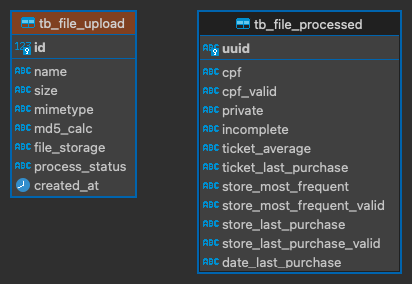
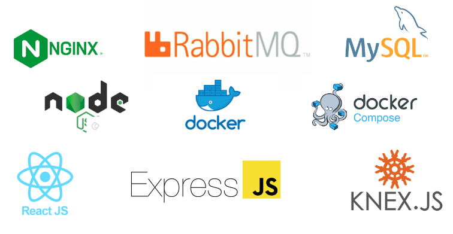

## [NEOWAY] Desafio Técnico de Back-End Pleno

A descrição do desafio em [task.md](https://github.com/t7cabral/neoway-backend-pleno/blob/main/task.md).

## Iniciar Serviços:

1. Clone o repositório do projeto '`git clone https://github.com/t7cabral/neoway-backend-pleno.git;`';

2. Na raiz do projeto execute o comando '`sudo ./start.sh`'. Se apresentar erro ***permission denied*** execute o comando '`chmod +x start.sh`' e tente novamente. Se o error persistir, tente '`docker-compose up -d --build`';

3. Após finalizado liste os containers com '`docker ps`';

4. O endereço da interface do **RabbitMQ** é [http://localhost:15672](http://localhost:15672). As credenciais são: [user: '**neoway**', password: '**3FrTBg7kxhEGZf48**'];

5. O endereço do frontend **WEB** é [http://localhost](http://localhost). Também é possível comsumir a **API** atravéz do [https://insomnia.rest/download](https://insomnia.rest/download). O arquivo para importação é **Insomnia-api.json**;

6. Cliente SQL para acessar o banco de dados: [dbeaver](https://dbeaver.io/download);

Todas as configurações e credencias de acesso estão no arquivo **.env** na raiz do projeto.

## Micro-serviços:

| NAME                | DESCRIÇÃO                                                   | PORT  |
|---------------------|-------------------------------------------------------------|-------|
| MySQL               | Banco de dados relacional.                                  | 3306  |
| RabbitMQ            | Serviço de mensageria para processos assíncrono.            | 15672 |
| API                 | API RESTful.                                                | 3000  |
| FILE-TEXT-EXTRACTOR | Processa o conteúdo dos arquivos e salva em banco de dados. |       |
| WEB                 | Front-end para envio de arquivo.                            | 80    |

## Tabelas do Banco de Dados:

**tb_file_upload:** Ao receber o arquivo, o serviço de API irá:
registrar as informações do arquivo nessa tabela; armazenar o arquivo em 'storage' para que o mesmo seja acessível por outros serviços; registrar um evento na fila 'file:new' para que o serviço **FILE-TEXT-EXTRACTOR** possa processar o arquivo; A coluna 'process_status' mantém o status do processamento do arquivo.

**tb_file_processed:** O serviço **FILE-TEXT-EXTRACTOR** consome a fila 'file:new' e: processa o arquivo validando CPF, CNPJ e armazena os dados nessa tabela; ao final atualiza o 'process_status' do registro na tabela 'tb_file_upload' e deleta o arquivo no 'storage'.

## Ferramentas Usadas:

Obrigado.

Att, Thiago Cabral ([linkedin](https://linkedin.com/in/t7cabral))
